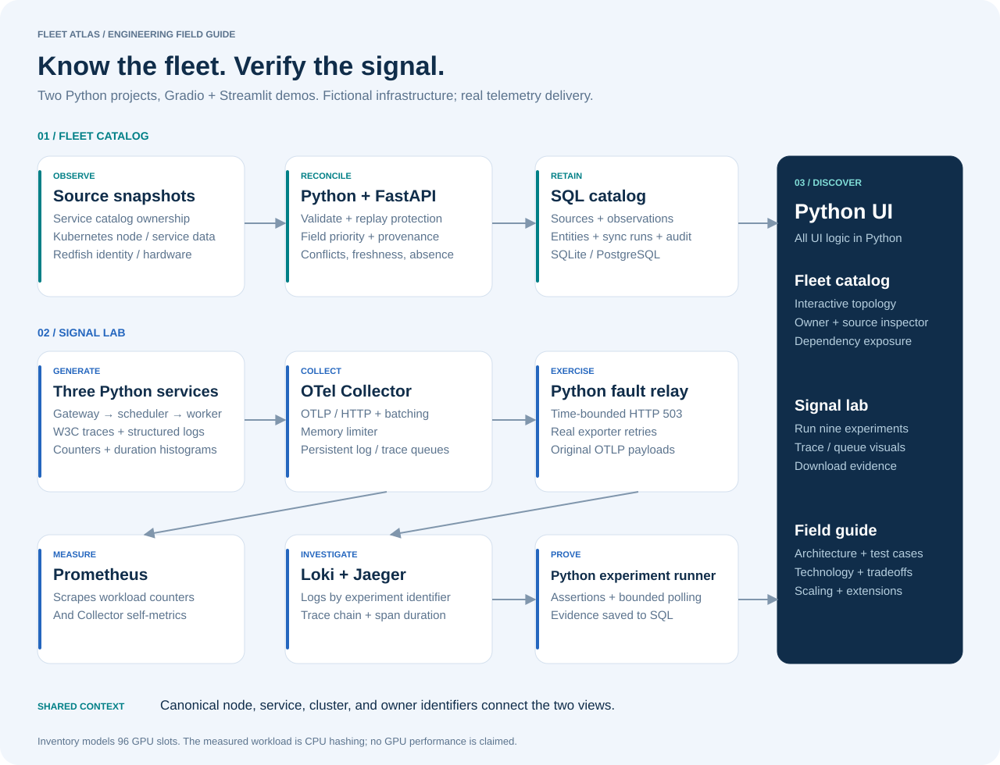

# Fleet Atlas

**Know what you operate. Follow the signal when it breaks.**

A Python infrastructure portfolio project by [Siva Babu](https://github.com/sivalinb). It includes a **Gradio telemetry reliability workbench** and a Streamlit fleet catalog:

1. **Fleet catalog** — reconcile infrastructure identity, ownership, and dependencies across multiple sources. Inspect provenance, stale observations, conflicting owners, and lifecycle history.
2. **Signal lab** — send real HTTP requests through three Python services, then run nine experiments covering delivery, cardinality, slow services, exporter outages, persistent versus in-memory crash recovery, retry exhaustion, and queue saturation.



The inventory is fictional: 2 clusters, 4 racks, 12 nodes, 6 services, and 3 teams. The 96 GPU slots are modeled inventory. **Telemetry experiments run actual Python CPU work and real OpenTelemetry, Prometheus, Loki, and Jaeger processes. They do not demonstrate GPU performance or production deployment.**

## Start the Python demo

Requirements: Python 3.12 recommended (3.11+ supported), macOS or Linux on arm64/amd64, internet for the first dependency/tool download, and roughly 2 GB of free disk for binaries and lab data. Windows users can use WSL2 or the Compose option.

```sh
git clone https://github.com/sivalinb/fleet-telemetry-lab.git
cd fleet-telemetry-lab
python3 -m venv .venv
source .venv/bin/activate
python -m pip install -r requirements.lock
python -m pip install --no-deps -e .
python scripts/install_tools.py
python scripts/run_stack.py
```

Open **http://127.0.0.1:7860** for the Gradio demo. Give the backends about 20 seconds to become ready. Ctrl-C stops the processes created by the launcher. The native path needs no Docker and keeps data in `.runtime/`. Official tool downloads are version pinned and checked against their published SHA-256 digests.

For the fleet catalog UI, use `python scripts/run_stack.py --demo streamlit` and open port 8501. For a smaller demo, `python scripts/run_stack.py --catalog-only` runs the catalog and Streamlit. The Signal lab explicitly shows that telemetry backends are unavailable.

Optional container path: `docker compose up --build`. It uses PostgreSQL for the catalog and mounts named data volumes. See [runtime differences](docs/ARCHITECTURE.md#runtime-paths). Do not run native and Compose simultaneously on the same ports. The checked-in configuration is a local lab; all published ports bind to loopback.

## A five-minute telemetry walkthrough

1. Run **Crash with a persistent queue**. Watch the backlog and verify all accepted probes recover after SIGKILL.
2. Run **Crash with an in-memory queue**. Original signals are lost; a fresh canary proves backend recovery.
3. Compare both rows in **History & comparison**, then load a run to inspect every assertion and download its HTML/JSON report.
4. Try **Retry exhaustion** and **Fill the sending queue** to see where persistence stops helping.
5. Run **Baseline**, **Cardinality growth**, or **Find the slow service** to investigate the three-service workload. Use **Instrumentation contract** to validate labels.

A passing expected-loss run means the hypothesis was verified, not that every signal arrived. Read the [illustrated telemetry guide](docs/TELEMETRY_LAB.md) for the exact boundaries.

## Present the project

The [HTML demo keynote](docs/keynote.html) is a 12-slide pitch with presenter notes and an interactive replay of real crash-recovery results. Download the HTML to present offline, or open **http://127.0.0.1:8001/docs-guide/keynote.html** while the API is running. [Presentation instructions and talk timing](docs/KEYNOTE.md) explain the recorded and live demos. Rebuild it with `python scripts/build_keynote.py`.

## Verify it

```sh
python -m pytest
.runtime/bin/promtool test rules observability/alerts.test.yaml
# With the full Gradio stack running:
python scripts/verify_reliability.py
# Optional standalone 20-event WAL recovery check:
python scripts/verify_recovery.py
```

The reliability suite runs all nine scenarios against real backends, checks active cancellation and subprocess cleanup, and verifies the Gradio API, contract editor, and report downloads. [Test cases and results](docs/TESTING.md) describe what was exercised. Results are stored in [evidence/](evidence/); rerunning checks replaces the corresponding samples.

## Explore the implementation

| Area | Entry point |
| --- | --- |
| Gradio telemetry demo | [gradio_app.py](gradio_app.py) / [Python UI](backend/fleetlab/demo.py) |
| Fleet catalog demo | [streamlit_app.py](streamlit_app.py) |
| API / interactive API docs | [backend/fleetlab/api.py](backend/fleetlab/api.py) / http://127.0.0.1:8001/docs |
| Identity and reconciliation | [catalog.py](backend/fleetlab/catalog.py) |
| Read-only source import | [import_source.py](scripts/import_source.py) / [examples](fixtures/README.md) |
| Instrumentation and contract | [workload.py](backend/fleetlab/workload.py), [contracts.py](backend/fleetlab/contracts.py) |
| Experiment runners | [telemetry.py](backend/fleetlab/telemetry.py), [isolation.py](backend/fleetlab/isolation.py), [job lifecycle](backend/fleetlab/jobs.py) |
| Persistent queue / export configuration | [observability/](observability/) |
| Illustrated field guide | [docs/](docs/OVERVIEW.md) / [portable HTML](docs/field-guide.html) |

All application, importer, orchestration, test, and guide-generation code is Python. Gradio, Streamlit, and Plotly render the interfaces; standard configuration files describe the third-party observability services. No custom JavaScript application is required.

## Documentation

[Telemetry workbench](docs/TELEMETRY_LAB.md) · [What it solves](docs/OVERVIEW.md) · [Architecture](docs/ARCHITECTURE.md) · [Technologies](docs/TECHNOLOGIES.md) · [Test cases](docs/TESTING.md) · [Scaling](docs/SCALING.md) · [Extension plan](docs/ROADMAP.md) · [Runbooks](docs/RUNBOOKS.md)

This is an inspectable lab, with explicit limits: one API worker, a full catalog projection on each import, local authentication only, bounded experiments, local log storage, and ephemeral Jaeger trace storage. It does not include a live GPU cluster, a full CMDB product, an ML model, or an AI agent. The roadmap describes concrete extensions without presenting them as implemented.
