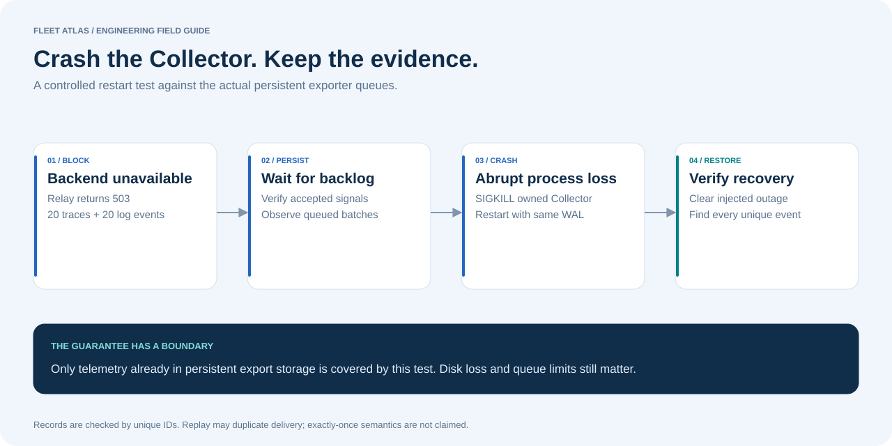

# Architecture and data flow

## Catalog path

Native JSON input → Python adapter → validated batch → SQL transaction → observations + resolved entities + audit → FastAPI → Streamlit.

`Source` records define priority and freshness. `Observation` is unique per source/external ID and points at a canonical entity. `SyncRun` stores a digest of the complete normalized batch. Replaying the same batch ID and contents returns an idempotent result; reusing the ID with different contents is a conflict. Older observations are rejected so delayed snapshots cannot roll back newer truth.

`Entity` is a materialized projection. Every imported batch rebuilds the small catalog inside its transaction. A failed batch rolls back its observations, projection, and history together. The API serializes catalog mutations within one process. **Run one API worker**; there is no distributed import lock in this version.

The graph derives edges from `cluster`, `rack`, `owner`, `runsOn`, and `dependsOn`. An in-memory reverse adjacency traversal finds affected dependents without looping on cycles. Unknown references become data-quality issues. Backstage export emits Group, Component, and Resource entities with owner and dependency references; it does not require a Backstage installation.

## Signal path

The gateway propagates W3C trace context to the scheduler and worker. The instrumentation contract requires service, namespace, environment, cluster, and owner attributes. IDs useful for investigation belong in logs and spans. The deliberate label-growth scenario is the single test path that bypasses the metric-label contract.

The Collector batches all signals. Logs and traces use separate bounded export queues backed by `file_storage`; metrics use a Prometheus exporter and scrape path. The fault relay returns 503 for a bounded period, then forwards the original OTLP payload to the configured backend. It cannot choose an arbitrary target from a user request.

The experiment runner polls Jaeger and Loki for actual delivery. It saves request IDs, trace IDs, latency measurements, queue samples, assertions, and errors to SQL. Missing measurements remain unavailable; failed delivery cannot produce a passing result. Metric comparisons are scoped to the three running service instance IDs so a restarted process does not contaminate a new run's cardinality comparison.

Persistent exporter storage protects data that reached those queues. It does **not** cover SDK buffers, the Collector batch processor before enqueue, disk loss, queue exhaustion, or retry expiry. Replay can duplicate data; this lab tests recovery of unique events, not exactly-once delivery. See the official [Collector resiliency guidance](https://opentelemetry.io/docs/collector/resiliency/).

## Runtime paths

| Concern | Native quickstart | Compose |
| --- | --- | --- |
| Python services | Managed child processes | Python 3.12 image, non-root application user |
| Catalog | SQLite with WAL, `.runtime/fleet.db` | PostgreSQL 17, named volume |
| Collector queue | `.runtime/collector` | Named persistent volume |
| Logs | Local Loki filesystem | Loki named volume |
| Traces | Jaeger in memory, 10,000-trace cap | Same cap; intentionally ephemeral |
| Metrics | Prometheus, 2-hour retention | Prometheus named volume, 2-hour retention |
| UI | Streamlit, port 8501 | Streamlit, port 8501 |

Native mode binds generated configurations to loopback. Compose publishes only loopback host ports and keeps workload/OTLP ports internal. Collector and Loki use root inside the local Compose containers to initialize their named storage directories; production deployment should pre-provision volume ownership and run them under dedicated UIDs.

The database tables are created for a new lab on startup. No schema migration framework is included. Authentication is an optional shared API bearer token; it is not user authorization. Streamlit sends API requests on its server, so configuring an API token does not authenticate people who can reach Streamlit. Keep the demo local, or place every exposed surface behind an authenticated TLS proxy before sharing a hosted instance.

The native path and SQL tests are the primary verification path. Compose syntax can be checked without a Docker daemon; only an actual container run validates image/runtime integration. Consult the evidence notes for what was run.
