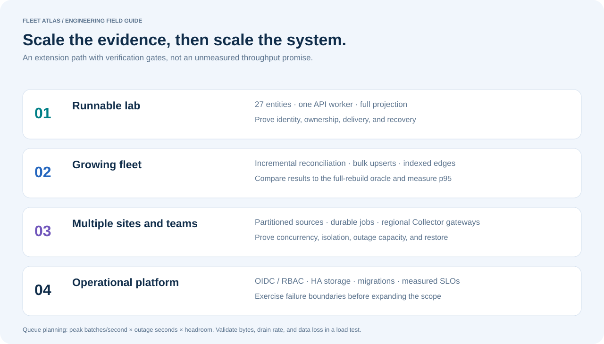

# Scaling without hiding the current limits

The checked-in fleet has 27 entities. The API accepts at most 5,000 records per batch and 100 relationship references per list. These are validation limits, **not measured capacity claims**. This version rebuilds the full projection and loads the graph into memory. It has not been benchmarked for large fleets or multiuser production traffic.



## Catalog scaling

| Stage | Change | Verification before rollout |
| --- | --- | --- |
| Current lab | Single API process, SQLite/PostgreSQL, transaction per import | Atomicity, replay, stale inputs, graph cycles |
| Thousands of records | Bulk upserts, indexed relationships, incremental reconciliation of touched entities | Compare incremental results against the full-rebuild oracle; measure p95 import and query latency |
| Multiple collectors/teams | Source partitioning, durable ingestion queue, per-source cursors, database advisory locks | Duplicate, reordered, missing, and concurrent batches; recovery from worker loss |
| Large catalogs | Paginated queries, server-side search, graph neighborhoods, read projections/caching | Memory per request; cache invalidation; bounded traversal depth and completeness metadata |
| Operational service | Tenant-scoped authorization, migration management, backup/restore, SLOs | Tenant isolation, restore drill, rollout/rollback, audit completeness |

Preserve raw source evidence and reconciliation policy versions. A corrected policy should allow a deterministic rebuild. Do not replace stable physical identity with hostname matching. Keep absence, deletion, decommissioning, and stale observation as separate lifecycle concepts.

## Telemetry scaling

Separate local collection from regional gateways. Partition load by site/cluster and keep the Collector memory limiter, queues, and storage monitored. Increase consumers only after measuring backend capacity; one consumer per signal is intentionally configured here to make queue behavior visible with a small workload.

Queue sizing starts with measured export batches, not request count:

```text
required queue batches ≈ peak accepted batches/second × tolerated outage seconds × headroom
drain time ≈ backlog batches / (export capacity − incoming batches/second)
```

For an illustrative planning case, 80 batches/second, a 120-second outage, and 1.5× headroom imply 14,400 queued batches. If export capacity is 200 batches/second after recovery and intake stays at 80, a 9,600-batch backlog drains in about 80 seconds. These are calculations, not measurements from this repository. Size disk using observed serialized batch bytes and recovery overhead; do not equate batch count with bytes or event count.

The lab queue limit is 2,000 batches **per logs/traces exporter**, with a 60-second retry horizon. Metrics use a scrape/export path and are not covered by those durable queues. Longer outages need deliberate capacity, retention, and durability decisions. A persistent queue is local to its process storage; losing the disk loses that protection.

For durable shared backends, replace local Loki files with a supported object-storage deployment and Jaeger memory with a supported persistent storage backend. Add high availability and retention policies separately from ingestion scaling. Consider a message broker only if measured durability/decoupling requirements justify its operational cost.

## Cardinality, cost, and useful signals

Estimate series as the product of label combinations across instruments and service instances. Request IDs create new combinations continuously; histogram buckets multiply the effect. The UI deliberately reports the request **counter** series to keep its 3×request comparison simple. It does not claim to count the complete histogram series cost.

Keep environment, cluster, service, and owner consistent. Review whether owner changes should create new series or be joined at query time at larger scale. Place high-cardinality investigation fields in log metadata/spans, define retention by purpose, and preserve error/latency evidence when introducing sampling. Tail sampling requires routing complete traces to the same decision point.

Before claiming a scale target, run a controlled benchmark with reproducible input sizes, ingest/query mixes, hardware specifications, p50/p95/p99 latency, process memory, queue occupancy, dropped data, and recovery time. Publish failure thresholds as well as successful runs.
