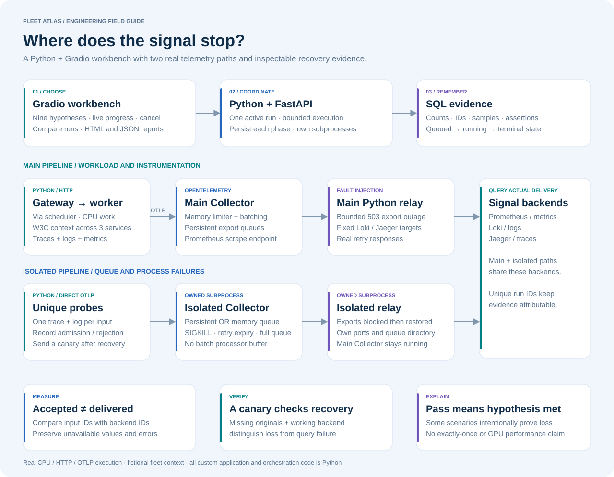

# Telemetry pipeline reliability lab

**A Python + Gradio workbench for finding where signals can be lost.** It sends real OTLP, introduces bounded faults, queries the actual backends, and saves the measurements needed to explain the result. It needs no GPU, cloud account, or model API key.

## What it solves

A healthy service and an HTTP 200 from a telemetry receiver do not establish end-to-end delivery. Data can remain in an SDK buffer, be refused by a full queue, expire during retries, or disappear when an in-memory collector crashes. This lab lets an engineer reproduce those boundaries and compare configuration choices with evidence.

The main pipeline uses three instrumented Python services. The isolated experiments launch their own collector and fault relay on temporary loopback ports, with separate storage. They never stop or reconfigure the main collector. A new trace/log canary after recovery checks that the backend is functioning when older signals are absent.

## Nine reproducible questions

| Experiment | Fault or choice | What a passing run establishes |
| --- | --- | --- |
| Baseline delivery | Bounded instrumentation | Every request has a complete gateway/scheduler/worker trace, gateway logs, and exported counters |
| Cardinality growth | Unique request IDs become metric labels | Three new counter series per request; histogram cost is additional |
| Instrumentation gate | The same forbidden label meets the contract | Every request is blocked before work; no service counter or gateway-log increase |
| Find the slow service | Worker sleeps 180 ms | Each worker span includes that delay |
| Backend outage | Relay returns 503 for eight seconds | Exports were rejected, queue filled, then the required evidence arrived |
| Persistent queue crash | Isolated collector receives SIGKILL with a backlog | WAL was written; every accepted probe trace and log is recovered after restart |
| In-memory queue crash | Same fault without file storage | Originals are absent; a new canary arrives after restart |
| Retry exhaustion | Persistent queue, one-second retry budget | Terminal failure counters increase; originals are absent; a new canary arrives |
| Queue saturation | Four queue requests per signal, one consumer | Excess ingress is rejected; enqueue failures are measured; accepted probes recover |

**Passing the last three experiments confirms an expected loss or rejection boundary. It does not mean every input was delivered.** Counts are from the bounded observation window, not a claim that an absent event could never appear later.

The isolated collector intentionally omits the batch processor: one HTTP request contains one span or log, so the receiver's response exposes exporter-queue admission. This differs from the main collector, whose memory limiter and batch processor introduce additional buffering boundaries. Isolated probes use one span per trace; main-pipeline requests produce a three-service trace chain.

## Runtime and evidence

The FastAPI service owns a single experiment manager. A run is written to SQL before execution, progress is persisted as phases change, and the API limits execution to 90 seconds. The Gradio page polls these records. Closing the browser leaves an API job running; **Cancel active run** cancels the task, clears a main-pipeline outage when applicable, and stops owned isolated subprocesses.

| API | Behavior |
| --- | --- |
| `GET /api/scenarios` | Nine scenario descriptions and hypotheses |
| `POST /api/runs` | Accept `{name, count}`; return 202 and a saved run ID |
| `GET /api/runs/{id}` | Read state, progress, and evidence |
| `POST /api/runs/{id}/cancel` | Cancel an owned task; retain its record |
| `GET /api/runs/{id}/report?format=html` | Download a portable illustrated report; `json` also supported |
| `GET /api/experiments` | Latest 30 saved runs for comparison |
| `GET /api/pipeline` | Live component readiness, metrics, collector counters, alerts |
| `POST /api/contract` | Validate required resource fields and metric label budget |

Only one experiment runs at a time; a concurrent API submission gets 409. Workload counts are 1–40; isolated scenarios require 8–40. Unknown scenarios are rejected before execution. After an API restart, queued/running records become `interrupted`. Runs are not automatically replayed. A hard kill of the API process cannot execute graceful subprocess cleanup; use the launcher and verify process ownership before manually clearing leftover lab processes. A future worker supervisor should own that failure boundary.

Trace IDs, event IDs, observed counts, phase samples, configuration, assertions, and failures are preserved. Metrics are scoped to the current workload instances. Missing backend measurements remain unavailable, not zero. Saved evidence remains useful after Jaeger restarts, though its original live trace links may no longer resolve because this lab stores traces in memory.

## Alerting and troubleshooting

Prometheus evaluates four rules: collector scrape failure, exporter queue above 70% for ten seconds, terminal export failures, and request-ID metric labels. The Gradio status strip shows active rules. Rules monitor the **main** collector and its workload series; isolated collectors expose their own measured counters in each run. A label-growth warning can remain active while the old series remain in Prometheus. No paging or external messages are sent.

Use `.runtime/bin/promtool test rules observability/alerts.test.yaml` to verify both firing and quiet cases. The fixture follows the official [Prometheus rule testing format](https://prometheus.io/docs/prometheus/latest/configuration/unit_testing_rules/).

When a run fails, inspect its first failed assertion, the backend readiness strip, and `.runtime/logs/`. Incomplete delivery and unavailable backends produce a nonpassing run. Re-run after fixing the cause; keep both records to explain what changed.

## Test cases

`python -m pytest` exercises API behavior plus job exclusion, cancellation, restart interruption, error persistence, configuration boundaries, report escaping, unavailable metrics, and Gradio rendering. `python scripts/verify_reliability.py` runs all nine real scenarios, cancels an active isolated run, then tests a streamed Gradio baseline, contract validation, and both report downloads. It writes inspectable JSON to `evidence/`.

Local verification used Python 3.12 on macOS arm64. GitHub Actions repeats native integration on Linux and checks PostgreSQL separately. Compose remains an optional local deployment path; the recorded evidence distinguishes it from native execution.

## Capacity planning and extension plan

Size queues from **measured exporter requests per second × tolerated outage seconds × headroom**, then verify bytes per request and available disk. For an illustrative 200 batches/s, 60 seconds, and 1.5× headroom, the queue target is 18,000 batches. If batches average 20 KB, payload alone is about 360 MB; WAL overhead and filesystem reserve are additional. These are planning inputs, not measured throughput of this lab.

Recovery capacity must exceed new ingestion. At 500 exported batches/s with 200 incoming, a backlog of 18,000 takes about 60 seconds to drain: `18000 / (500 - 200)`. Validate the backend's sustained capacity, memory, retry limits, and disk behavior under load before using that calculation operationally.

| Next increment | Implementation direction | Acceptance evidence |
| --- | --- | --- |
| More realistic fault boundaries | Disk quota exhaustion, one-signal failure, sampling, SDK shutdown loss | Measure accepted, rejected, duplicate, and missing IDs separately |
| Sustained load | Rate-controlled producers, fixed dataset, per-signal byte counts | Throughput, queue bytes, p95 delivery delay, drain capacity, resource usage |
| Multiple collectors | Agents by host and gateways by region/failure domain | Collector loss with bounded backlog and no cross-tenant data leakage |
| Multiple users | OIDC, RBAC, durable jobs, worker leases, cancellation ownership | Concurrent submissions, worker crash recovery, access isolation |
| Durable backends | Object-backed Loki, production trace storage, HA metrics, retention | Restore drills and declared retention/delivery objectives |
| Catalog integration | Resolve service ownership and dependencies into evidence bundles | Missing/stale owner is explicit; historical context retained |
| AI investigation assistant | Read-only queries and cited explanations after the deterministic runner | Known loss, ambiguous data, missing evidence, and malicious log-text evaluations |

The current lab is intentionally small: one API worker, local queue storage, bounded traffic, no automatic database/Loki pruning, and ephemeral Jaeger traces. Persistent queues are not a substitute for a durable telemetry architecture. See [Collector resiliency](https://opentelemetry.io/docs/collector/resiliency/) for the upstream queue and retry model.
